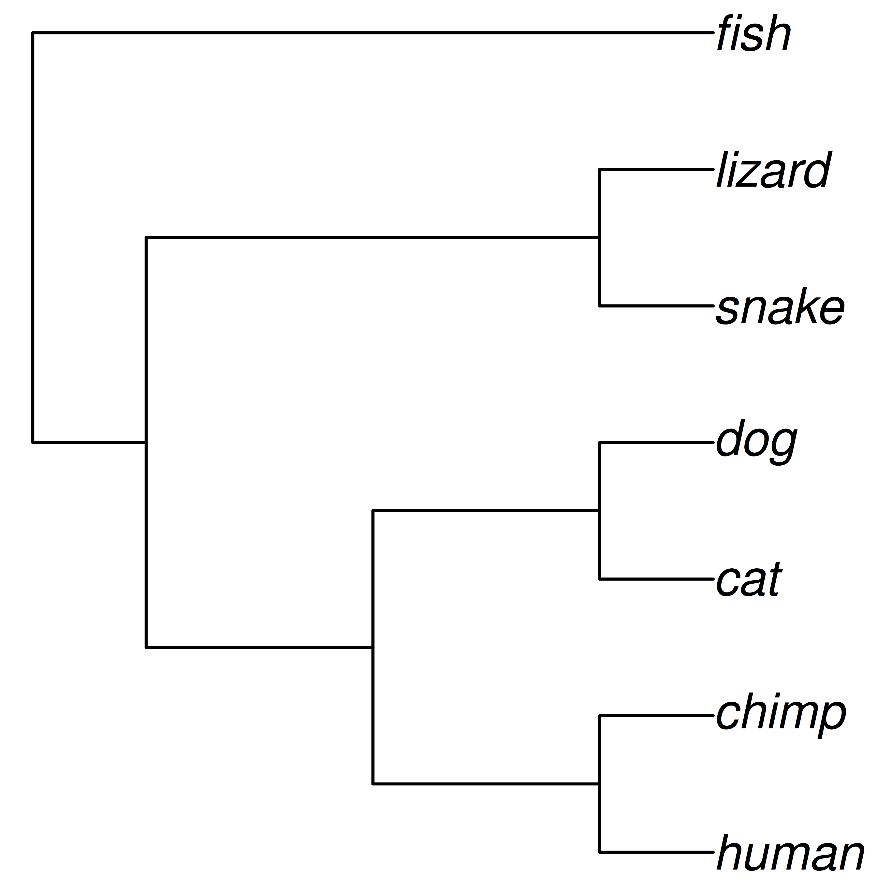
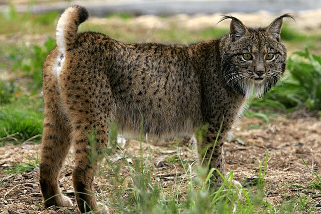
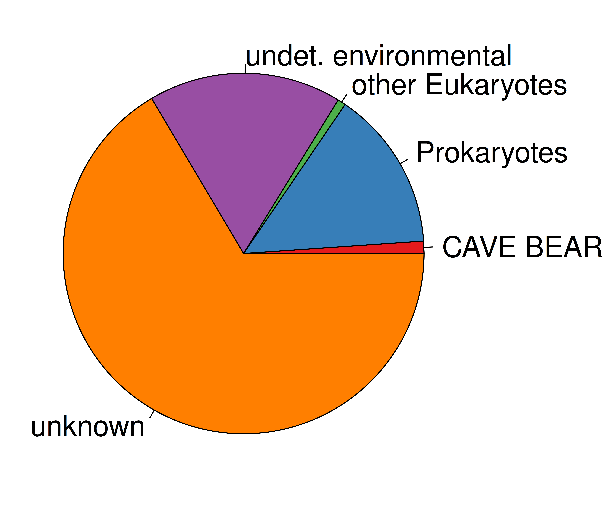

## Ancient DNA: today's lecture {.slide}

- Molecular phylogenetics
- Ancient DNA
- Sabretooth cats
- Sequencing the North Sea *Homotherium*

# Molecular phylogenetics

## Molecular phylogenetics {.flex-cols}
<!-- You've probably seen diagrams like this... -->

- This is called a **phylogeny**
- It represents the evolutionary process
- The phylogeny is like an evolutionary tree
- The **tips** are species
- **Nodes** are their common ancestors
- **Molecular phylogenies** are based on DNA data

## Mutation and inheritance creates the tree {.flex-cols}

- Each generation has new mutations, which get passed on to the next
- Human mutation rate ~1.1×10−8 per site per generation
- Human: ~40 mutations in your 3.6 Gb genome
- DNA divergence and time are (approximately) linearly related
- Branch lengths show the genetic divergence

## DNA sequence alignment

## Mitochondrial DNA is great for phylogenetics! {.columns-2}

  

- Small genome (~16,000 base pair)
- High mutation rate
- Many copies per cell
- Maternally inherited

# Ancient DNA

## "Ancient DNA" is just old DNA

## Some samples don't fit in the lab!

## Allows study of extinct species / populations

## Ancient DNA can tell us about...    *Extinction dynamics* 

## Ancient DNA can tell us about...   *Interbreeding & conservation practices*  {.flex-cols}

*www.lynxexsitu.es, CC BY-SA 3.0*

## Ancient DNA can tell us about...     *Dwarfing on islands* 

*Sicilian dwarf elephant, Zde, CC BY_SA 4.0*

## Ancient DNA can tell us about...     *Just really weird things* 

*Macrauchenia, Olliga, CC BY_SA 3.0*

## Ancient DNA is important!

## But over time, most DNA gets lost

*Zátonyi Sándor, CC BY-SA 3.0*

## This makes the work contamination sensitive

*Copyright Karla Fritze, Potsdam University*

## And we can do this stuff here in Bangor!

## But the samples are already contaminated {.white-slide}

*Data from Noonan et al. 2005. Science*

# Sabretooth cats

## There were multiple genera of sabretooth cats

- A **genus** is a group of closely related species. It's the first part of the scientific name
- e.g. ***Homo sapiens***

## *Smilodon* {.flex-cols}

- The most commonly known group
- Massive canines
- Up to 400 kg and 120 cm shoulder height
- N and S America
- 3 species, *S. gracilis, S. populator, S. fatalis*
- Extinction 10 Ka ("Kilo annum")

 

*Sergiodlarosa, CC BY-SA 3.0*

## *Homotherium* {.flex-cols}

- Less known group
- Also known as scimitar-toothed cats
- Flat, serrated canines
- ~ 200 kg and 110 cm shoulder height
- Europe, Asia, Africa, N and S America
- Pleistocene Europe: *H. latidens*, extinction 300 Ka
- Pleistocene N. America: *H. serum*, extinction 12 Ka

 

*Sergiodlarosa, CC BY-SA 3.0*

## Pleistocene sabretooth cats

## Fishing for fossils

## Fishing for fossils

- Britain connected to mainland Europe by an area called **Doggerland**
- Rising sea levels 6-7 ka flooded the area, making Britain an island

## 16th March 2000, something turned up...

→ This didn't look like a 300 Ka fossil!

## Dating of the Dutch North Sea *Homotherium*

> - The bone was radiocarbon dated at 31,300 ± 400!
> - This was extraordinary, so the dating was repeated
> - New dates:
>     - 31,300 ± 400
>     - 26,900 ± 400
>     - 26,700 ± 240
>     - 28,100 ± 220
>     - 27,650 ± 280
> - The first Late Pleistocene European *Homotherium*

## Didn't fit in the picture!

# DNA analysis of North Sea *Homotherium*

## Sequencing of ancient DNA

## Sequencing experiment 1

> - Total sequences = 2,628,309
> - *Homotherium* sequences grand total = 
> - 1 &nbsp;&nbsp;&nbsp; 😂

## DNA hybridisation capture {.flex-cols}

- DNA has 2 strands, arrange in a double helix
- It can be heat denatured
- When cooled, the single strands will stick (hybridise) to strands with a similar sequence
- We can "fish" target sequences from a pool of contaminants

 

## DNA hybridisation capture*

***→ \*Of course this only works if you know the sequence in advance! ***

## Mistaken identity {.columns-2}

*Meanwhile a Danish group were investigating North American cave lion DNA*

> - Sequence analysis showed it was actually a ***Homotherium***!

> - This provided the sequence for the hybridisation capture baits

  

## Sequencing experiment 2   (hybridisation capture)

> - Total sequences = 72,759,982
> - *Homotherium* sequences grand total = 
> - 12,050,089 &nbsp;&nbsp;&nbsp; 🎉

> - 3 *Homotherium* and 1 *Smilodon* mitochondrial genomes

## Phylogenetic analysis of sabretooth cats

## Mutation and inheritance creates the tree {.flex-cols}

- Each generation has new mutations, which get passed on to the next
- Human mutation rate ~1.1×10−8 per site per generation
- Human: ~40 mutations in your 3.6 Gb genome
- DNA divergence and time are (approximately) linearly related
- Branch lengths show the genetic divergence

## Molecular dating of sabretooth cats

## Molecular dating of sabretooth cats

## Ancient DNA analysis of sabretooth cats

- Sabretooths divergence from living cats 20 Ma
- *Homotherium* and *Smilodon* were more diverged from one another than any living cats
- A huge diversity was lost with the extinction of the sabretooths
- North American and European *Homotherium* were genetically similar
- We recommended they be treated as a single species, *H. latidens*

## Paijmans et al. 2017

<embed src="./pdf/Paijmans et al. - 2017.pdf" width="100%" height="500" type="application/pdf" />

# Thank you for listening!

***Ancient DNA: unlocking the secrets of extinct animals***

Dr. Johanna Paijmans

[j.paijmans@bangor.ac.uk](mailto:j.paijmans@bangor.ac.uk)

